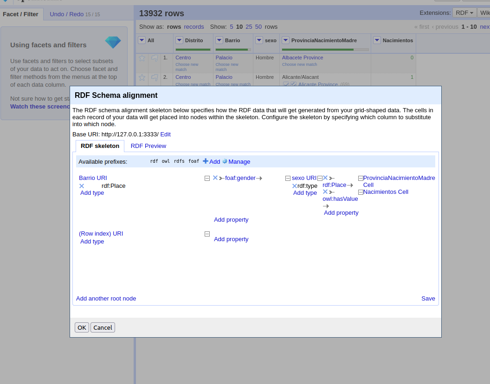

# Datos de nacimientos según la provincia de nacimiento de la madre de la Comunidad de Madrid

## 1.- Introducción

El objetivo de este trabajo es la generación de datos enlazados en formato RDF. Se generarán a partir de un csv que contiene los nacimientos y lugares de nacimientos de las madres de los bebés de la comunidad de Madrid. Para ello se van a transformar los datos para poderlos analizar y explotar de manera más precisa.

## 2.- Proceso de transformación

### 2.1 Selección de fuente de datos

Dentro de https://datos.comunidad.madrid/catalogo/ hemos decidido escoger los datos de nacimientos y dentro de estos, los nacimientos de bebes con el lugar de nacimiento de sus madres. Entre todos los posibles datos este me parecía interesante ya que antes del covid la mayor parte de la gente se mudaba a Madrid porque es donde hay trabajo, ahora con las opciones de teletrabajo creo que esto cambiará afortunadamente. Este conjunto de datos. Estos datos son actualizados anualmente y la fecha de actualización es marzo de 2019

### 2.2 Análisis de los datos

La licencia es 	Creative Commons Attribution que significa que somos libres de usar los datos siempre y cuando indiquemos la atribución de los mismos (lo cual, hemos hecho en el apartado anterior) y los usemos o no, para propositos comerciales, siendo un trabajo universitario cumplimos con los términos.

Después de analizar la licencia pasamos a explicar el tipo de datos, es un csv con las siguientes columnas:
  - municipio_codigo: es un campo de tipo numérico. Todos los registros pertenecen al mismo código de municipio que es 79 que equivale a la comunidad de Madrid
  - municipio_nombre: es una columna de tipo string que es también única.
  - distrito_codigo:esta columna es de tipo numérico, no tiene valores únicos pero no hay que entenderla como numérico ya que no hay una relación ordinal entre los distritos
  - distrito_nombre: es un campo de tipo string que está totalmente relacionado con distrito_codigo, es decir, a cada codigo de distrito le corresponde un nombre
  -barrio_codigo: es un campo de tipo numérico pero que no tiene relación ordinal. Está relacionado con distrito codigo de manera que un código de distrito contiene uno o varios barrio_codigo
  - barrio_nombre: es un campo de tipo string cuya relacion es similar a barrio_codigo con distrito_codigo pero con distrito_nombre
  - sexo: es un campo de tipo string que contiene dos valores: Hombre y Mujer
  - provincia_nacimiento_de_la_madre: es un campo de tipo string que contiene las 52 provincias españoles, nací en el extranjero y no consta provincia de nacimiento, es decir, contiene 54 valores diferentes
  - numero_nacimientos: es un campo de tipo numérico, esta vez si que tiene relación de ordinalidad.

Sabiendo esta estructura y signidicado vamos a seleccionar aquellos que realmente aportan información que son los siguientes: distrito_nombre, barrio_nombre, sexo, provincia_nacimiento_de_la_madre y numero_nacimientos y crearemos un campo nuevo que sea identificador en el cual todos sus valores son únicos.

### 2.3 Estrategia de nombrado

Buscando en internet no he encontrado ningún vocabulario de tipo y estructura usable para los nacimientos y lugares de nacimiento de las madres por lo que he optado por generar uno propio con la intención que pueda reutilizarse en un futuro

Como en la mayoría de los casos similares, he optado por usar (/) para las URIs de los individuos y (#) para la ontología 

 - El dominio que vamos a elegir es:
    http://trabajoWebSemantica.linkeddata.es

 - La uri de los individuos: 
    http://trabajoWebSemantica.linkeddata.es/Madrid/nacimientosregistros/

 - Patrón para los individuos:
     http://trabajoWebSemantica.linkeddata.es/Madrid/nacimientosregistros/barrioyciudadmadre

 - La uri de la ontología:
    http://trabajoWebSemantica.linkeddata.es/Madrid/nacimientos#
 
 - Patrón para los términos ontológicos:
    http://trabajoWebSemantica.linkeddata.es/Madrid/nacimientos#

### 2.4 Vocabulario

Vamos a intentar reutilizar en la medida de lo posible el vocabulario de dbpedia que tienen para lugar de nacimiento y crear las partes que no tiene para nuestros datos. 

ONTOLOGÍA

### 2.5 Proceso de transformación

Para el proceso de transformacion hemos decidido usar OpenRefine y la extensión RDF

1.- Elimino las columnas no necesarias porque sean igual a otras y no aporten información nueva

2.- Transformamos las columnas a números (las numéricas) porque el resto de columnas no hay que transformarlas

3.- Renombramos las columnas

4.- Creamos el RDF

### 2.6 Enlazado

1ro vamos a reconciliar las provincias de nacimiento de la madre. Al probar con Wikidata nos sugiere reconciliar con province of Spain

2do hacemos lo mismo con Barrio y podemos reconciliar con neighborhood of Madrid tal como nos sugiere wikidata

3ro hacemos finalmente lo mismo con Distrito, reconciliamos con district of Madrid

Estas reconciliaciones se hacen para poder ejecutar consultas más complejas con SPARQL

### 2.7 Publicación

No se va a proceder a la publicación

## 3.- Aplicación

En este apartado vamos a ver como se harían unas consultas para explotar los datos a nuestro gusto

Ejemplo1: Provincias con más nacimientos en orden y agrupadas
"""

@prefix onto: < http://trabajoWebSemantica.linkeddata.es/Madrid/nacimientos#> .

SELECT  ?ProvinciaNacimientoMadre ?Nacimientos
GROUP BY ?ProvinciaNacimientoMadre
ORDER BY ?Nacimientos

"""Ejemplo2: Barrios de Madrid de donde han nacido más bebés de madres Segovianas"""

@prefix onto: < http://trabajoWebSemantica.linkeddata.es/Madrid/nacimientos#> .

SELECT  ?Barrio ?ProvinciaNacimientoMadre ?Nacimientos WHERE {
    FILTER regex(?ProvinciaNacimientoMadre, "Segovia Province")
}
GROUP BY ?Barrio
ORDER BY ?Nacimientos

"""## 4.- Conclusiones

Vemos como con wikidata se puede reconciliar, es decir, enlazar las ubicaciones, incluso los barrios para así poder realizar de una forma más simple las consultas. Tambien he de mencionar que me ha parecido una práctica muy compleja en comparación con lo que he visto de teoría teniendo que indagar por internet bastante para poder completarla

## 5.- Bibliografía

*   OpenRefine
*   Plataforma virtual de la asignatura
*   w3.org
*   https://skos.um.es/TR/rdf-sparql-query/
*   http://dbpedia.org/
"""