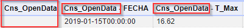
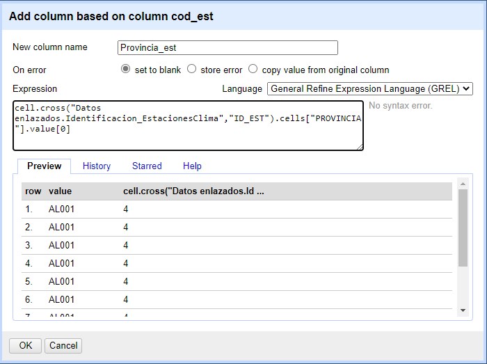
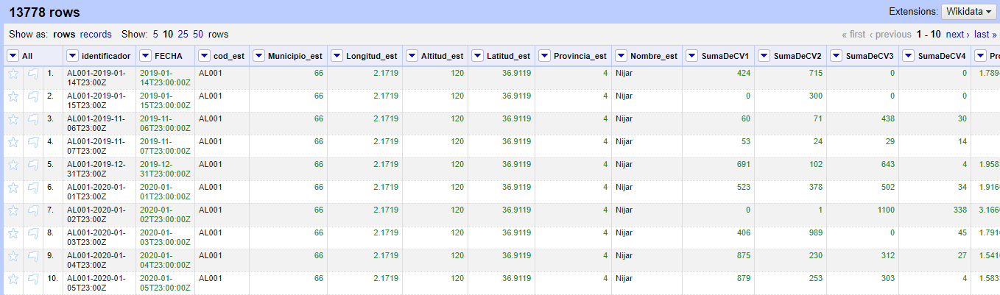

Memoria

Datos climáticos obtenidos por Red de Estaciones Agroclimáticas [2002-2020]. Red de Alerta e Información Fitosanitaria (RAIF)

1.- Introducción:
En este trabajo, transformaremos un conjunto de datos basados en el registro de distintas variables meteorológicas en estaciones meteorológicas de Andalucía. Concretamente se trata de datos climáticos obtenidos por la red de estaciones agroclimáticas de la Red de Alerta e Información Fitosanitaria (RAIF). 
La transformación a datos enlazados permitirá la explotación de los mismos.

2.- Proceso de transformación

2.1.- Selección de la fuente de datos
Estos datos se obtienen del portal de la Junta de Andalucía de datos abiertos (https://www.juntadeandalucia.es/datosabiertos/portal/dataset/raif-clima).
Los requisitos de selección de la fuente de datos serán:

  2.1.1.- Escenario real: datos climáticos de la red de estaciones agroclimáticas de Andalucía.
  
  2.1.2.- Disponibilidad de los datos: 
  
  2.1.2.1.- Datos en un formato procesable automáticamente: los datos están comprimidos en un .zip, que contiene ficheros .xml.
  
  2.1.2.2.- Licencia. Reconocimiento 4.0 Internacional (CC BY 4.0) 
  
  This is a human-readable summary of (and not a substitute for) the license. Advertencia. 
  Usted es libre de:
  
  •	Compartir — copiar y redistribuir el material en cualquier medio o formato
  
  •	Adaptar — remezclar, transformar y crear a partir del material
  
  •	para cualquier finalidad, incluso comercial.
  
  •	El licenciador no puede revocar estas libertades mientras cumpla con los términos de la licencia.
  
  Bajo las condiciones siguientes:
  
  • Reconocimiento — Debe reconocer adecuadamente la autoría, proporcionar un enlace a la licencia e indicar si se han realizado cambios<. Puede hacerlo de cualquier manera         razonable, pero no de una manera que sugiera que tiene el apoyo del licenciador o lo recibe por el uso que hace. 
  
  •	No hay restricciones adicionales — No puede aplicar términos legales o medidas tecnológicas que legalmente res trinjan realizar aquello que la licencia permite.
  Avisos :
  
  •	No tiene que cumplir con la licencia para aquellos elementos del material en el dominio público o cuando su utilización esté permitida por la aplicación de una excepción o       un límite.
  
  •	No se dan garantías. La licencia puede no ofrecer todos los permisos necesarios para la utilización prevista. Por ejemplo, otros derechos como los de publicidad, privacidad,     o los derechos morales pueden limitar el uso del material.
  2.1.3.- Posibilidad de enlazar con entidades genéricas (lugares)

2.2.- Análisis de datos
Al descomprimir el zip, disponemos de 3 tipos de ficheros:

•	Datos: Clim_Diario_2020.xml, Clim_Diario_2019.xml … Cargaremos sólo 2020, por agilidad en los procesos y capacidad de computación.

•	Descripción de los campos: Descripcion_Campos.xml.

•	Datos sobre las estaciones: Identificacion_EstacionesClima.xml.

En la descripción de los campos, los nombres no coinciden completamente con los campos que después encontramos en el fichero de datos, pero son fácilmente reconocibles:

Al importar de xml de datos (Clim_Diario_2020.xml), aparecen 20 líneas en blanco por cada registro (hay 20 campos). Las eliminamos con herramientas de OpenRefine.

Cambiamos el nombre de las columnas, porque al cargar, OpenRefine les ha antepuesto el primer tag que aparece en el xml.

Transformamos las columnas que son números en numéricas. Son todas las columnas menos el código de estación y la fecha de anotación del registro.

Obtenemos los siguientes tipos de datos:

Con las facetas, podemos analizar para una columna, sus valores máximos, mínimos, nulos, etc.
Añadimos una columna, unión de COD_EST y FECHA para tener un identificador único de cada registro.

Finalmente, utilizando el fichero de datos de estaciones (Identificacion_EstacionesClima.xml), añadimos estos datos a nuestro dataset, uniendo por código de estación:

NOMBRE	PROVINCIA	LATITUD	ALTITUD	LONGITUD	MUNICIPIO

Expresión para join con otro dataset, por identificador de estación:

cell.cross("Datos enlazados.Identificacion_EstacionesClima","ID_EST").cells["NOMBRE"].value[0]

Resulta el siguiente dataset:

2.3.- Estrategia de nombrado de recursos

Usaremos ‘#’ para términos ontológicos.

Usaremos ‘/’ para individuos.

Dominio: https://raif-clima.datosenlazados.es

Ontología: https://raif-clima.datosenlazados.es/ontology#

Recursos: https://raif-clima.datosenlazados.es/recursos/

Estaciones: https://raif-clima.datosenlazados.es/recursos/estaciones

2.4.- Desarrollo del vocabulario

Usaremos la siguiente ontología, que parece que se puede ajustar bastante bien a los datos que tenemos:

The Aemet Network of Ontologies

que tiene el siguiente grafo conceptual:

Definimos el mapeo entre el esquema de nuestros datos y la ontología que hemos definido. Hemos definido un campo único, mediante el nombre de la estación y la fecha, al que llamaremos observación. Para la definición de su URI usaremos la siguiente expresión: "observacion"+valor. Además de los datos recogidos en la estación, pondremos de manifisto que esta estación pertenece a un municipio, que a su vez pertence a una provincia. Implementamos estas relaciones editando el RDF Skeleton. Queda el siguiente esquema:

2.5.- El proceso de transformación de datos lo hemos llevado a cabo al realizar el análisis de datos, transformando los datos según fuera necesario.

2.6.- Enlazados de datos

Llevamos a cabo el enlazado de datos a través de la herramienta de reconciliación de OpenRefine; previamente, añadimos el servicio de reconciliacion de DBPedia español (https://es.dbpedia.org/sparql). Marcamos entonces la reconciliación por tipo Municipality en la herramienta de conciliación:

Conseguimos enlazar un 66% de los campos, pero la herramienta permite enlazar algunos valores de forma individual. Por ejemplo, se queda Níjar sin enlazar, pero podemos enlazar sólo por ese valor, a partir de una lista de sugerencias que ofrece la herramienta:

Algunos valores también se quedan sin enlazar porque el valor del campo es nulo:

Efectivamente, cuando transformamos datos e hicimos join por el código de estación con el fichero de estaciones, podemos observar que hay datos que no vienen:

Finalmente, añadimos una columna a nuestro dataset con las url encontradas:

A partir de esta columna, llevamos a cabo el enlazado de datos propiamente dicho, editando de nuevo el RDF Skeleton. Debemos generar la relación owl:sameAs que indica que el individuo de nuestro dataset (nombre_est en esta caso), es el mismo individuo que el encontrado en DPpedia:

3.- Aplicación y explotación.
La solución desarrollada aporta información sobre el municipio en que se encuentra la estación. Se podrían obtener datos por ejemplo de la media de precipitaciones registrada en la estación meteorológica de un municipio, sabiendo además, por ejemplo, la población existente en ese municipio. 

Podemos codificar un programa en R (.Rmd), para hacer consultas sobre el dataset:

Además, en el dataset tenemos latitud y longitud de las estaciones meteorológicas. Con esto, podemos representarlas en un mapa, mediante la librería library
ggmap, según se expone en el tema 12 de la asignatura. Tendremos entonces una representación visual de, por ejemplo, el municipio spbre el que estemos calculando la media de precipitaciones.

5.- Bibliografía
5.1.- Material de la asignatura (MUIIA: Web semántica y datos enlazados)
5.2.- Datos obtenidos del portal de la Junta de Andalucía de datos abiertos: https://www.juntadeandalucia.es/datosabiertos/portal/dataset/raif-clima
5.3.- Ontología AEMET: http://aemet.linkeddata.es/ontology/

