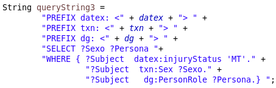

1. INTRODUCCIÓN

Este trabajo consistirá en la generación de datos enlazados en formato RDF, a partir de un conjunto de datos estructurado relativo a los accidentes sucedidos en la ciudad de Madrid. Para ello se realizará un análisis y preparación de los datos, todo ello orientado a una explotación posterior de los mismos mediante Sparql. Así mismo se definirá una ontología adecuada al dominio de los datos y se llevará a cabo el enlazado con otros conjuntos de datos.
Una vez transformados a RDF los datos podrán ser consultados para obtener información relevante.

2. PROCESO DE TRANSFORMACIÓN

a) Selección de la fuente de datos:

Como punto de partida analicé varios de los portales de datos abiertos sugeridos en las lecciones de la asignatura. En el caso de los datos abiertos del Gobierno de España (datos.gob.es) me encontré con multitud de datos publicados con contenidos muy pobres, así como datasets de tipo resumen o demasiado generales. Al no contar con información interesante que analizar y transformar decidí usar otras portales, en concreto el Portal de datos abiertos del Ayuntamiento de Madrid (https://datos.madrid.es/portal/site/egob/). Aquí ya se mostraban datasets con mayor riqueza en la información contenida, lo que permite realizar consultas finales más interesantes sobre los datos. Entre varios que preseleccioné (reservas de motos, objetos perdidos en taxis, incidencias de bomberos, etc.) el que me pareció más útil para ser explotado, tanto por los campos contenidos y por el número de registros, fue el de Accidentes de tráfico de la Ciudad de Madrid:
https://datos.madrid.es/portal/site/egob/menuitem.c05c1f754a33a9fbe4b2e4b284f1a5a0/?vgnextoid=7c2843010d9c3610VgnVCM2000001f4a900aRCRD&vgnextchannel=374512b9ace9f310VgnVCM100000171f5a0aRCRD&vgnextfmt=default

Este conjunto de datos se puede obtener para periodos de un año completo, por lo que trabajaré con el año 2018, ya que los datos de 2019 y 2020 son provisionales.
Cada registro corresponde a una persona afectada en un accidente dado, y los campos de información se corresponden con datos sobre la ubicación, el estado del asfalto, lesividad, sexo, edad, etc. En el apartado siguiente (Análisis de los datos) se verá cada campo en detalle

b) Análisis de los datos:

Para realizar el análisis y pre-procesado de los datos utilizaré la herramienta OpenRefine, junto a la extensión RDF.
Los diferentes campos que presenta el dataset son:

- FECHA: contiene un texto concatenando el día de la semana y el mes (expresados en inglés con tres carácteres), el número de día del mes, la hora CET y el año. Si se aplica una transformación común a fecha de este campo mediante la edición de celdas se obtiene una transformación errónea, por lo que es necesario realizar cambios primero para poder obtener un campo fecha válido por separado.

Al aplicar una faceta de texto a este campo observamos que la información de la hora no es útil, ya que en todos los registros se muestra el valor 00:00:00. Para contar con la posibilidad de trabajar con una información tan relevante como la hora existe otro campo con información del rango horario, que podremos utilizar para aportar riqueza y mayor nivel de detalle en las consultas.

No obstante, dicha información horaria sería conveniente guardarla en un campo aparte, ya que puede que futuros datasets publicados para nuevos años sí contengan la hora real.
Adicionalmente, la información del día de la semana ya está disponible en otro campo, con lo que podemos elilminarla del campo 'FECHA', sin necesidad de guardarla en una nueva columna.

- RANGO HORARIO: se muestra un rango horario de una hora para expresar el momento del accidente. Aunque no tenemos la precisión que aportaría la hora exacta, con esta información podría ser útil para trabajar en consultas finales, utilizando este campo con transformaciones adicionales y/o con el uso de propiedades.

- DIA SEMANA: presenta el día de la semana en mayúsculas

- DISTRITO: incluye el nombre del distrito de la ciudad de Madrid. Este campo se podría usar con un servicio de reconcilicación posteriormente para realizar el enlazado de datos, ya que nos podría aportar algún tipo de información relevante de cada lugar y que no está presente en el dataset original, como su población, localización,etc.

- LUGAR ACCIDENTE: este campo se destina a la información de la calle, o cruce de dos calles, donde tuvo lugar el accidente. A la hora de transformar el dataset, este campo debería ser tratado para separar las dos calles en el caso de que el accidente corresponda a un cruce. En estos casos se separan con un guión en la columna original. En los accidentes cuya localización se exprese con una sola calle encontramos al final el texto "NUM", indicando que en el campo siguiente ("Nº"), veremos un valor numérico asociado al número de la calle.
También podemos encontrarnos con el texto "KM." al final, indicando que se trata de un accidente en una vía o carretera, no en una calle. En estos casos el campo "Nº" presentará un valor numérico

- Nº: el número de la calle donde se ubica el accidente, cuando proceda al no corresponder a un cruce. Si aplicamos una faceta numérica a este campo combinada con un faceta de texto que nos permitan filtrar y seleccionar registros, vemos que hay 494 valores no-numéricos y que deberíamos convertir para homogeneizar la información. Corresponden a valores vacíos de accidentes en cruces, cuyo valor debería ser 0, como vemos en el resto de casos con registros de accidentes en dos calles.

También se observan valores numéricos muy elevados, que corresponden aparentemente a indicaciones del kilómetro de la vía en el que se produjo el accidente. Parece ser que en estos casos el valor númerico del campo corresponde a metros y no a kilómetros, como se podría pensar de la información del campo "LUGAR ACCIDENTE" adyacente. Se podría pensar en algún tipo de restricción a la hora de introducir los valores en ese campo que impedía trabajar con decimales, por ejemplo, y obligó a introducir la información como entero.
Se identifica algún caso conflictivo, como expresar el texto con el indicativo "NUM" y encontrarnos con valores asociables al tipo kilómetro ("KM.")

- Nº PARTE: indica el número de parte del accidente, expresado con el formato AAAA/número secuencial. Este campo lo podremos utilizar como el clave para identificar cada accidente de manera única. Cada registro de accidente puede tener varias filas, que corresponden a diferentes victimas o testigos.

- CPFA Granizo: granizo en el momento del accidente. Campo de condiciones ambientales con posibles valores SI o NO

- CPFA Hielo: presencia de hielo en el momento del accidente. Campo de condiciones ambientales con posibles valores SI o NO

- CPFA Lluvia: lluvia en el momento del accidente. Campo de condiciones ambientales con posibles valores SI o NO

- CPFA Niebla: niebla en el momento del accidente. Campo de condiciones ambientales con posibles valores SI o NO

- CPFA Seco: ambiente seco en el momento del accidente. Campo de condiciones ambientales con posibles valores SI o NO

- CPFA Nieve: nieve en el momento del accidente. Campo de condiciones ambientales con posibles valores SI o NO

- CPSV Mojada: estado mojado de la vía. Campo de estado de la vía con posibles valores SI o NO

- CPSV Aceite: estado con aceite de la vía. Campo de estado de la vía con posibles valores SI o NO

- CPSV Barro:  vía con barro. Campo de estado de la vía con posibles valores SI o NO

- CPSV Grava Suelta: vía con grava suelta. Campo de estado de la vía con posibles valores SI o NO

- CPSV Hielo: vía con hielo. Campo de estado de la vía con posibles valores SI o NO

- CPSV Seca Y Limpia: vía seca y limpia. Campo de estado de la vía con posibles valores SI o NO

- Nº VICTIMAS: número de víctimas del accidente, el cual es diferente de los implicados. Este valor se repite en cada fila asocida a un mismo parte, y muestra el total de heridos leves, graves o muertos. Cada fila de por sí ya nos estaría aportando esta información y en mayor detalle, al incluir campos para identificar el tipo de persona y la lesividad. Pero este campo puede resultar interesante para simplificar posibles consultas en las que queramos filtrar de alguna manera los accidentes por las personas implicadas.

- TIPO ACCIDENTE: se especifica a qué tipo de accidente corresponde el registro, con una serie de valores posibles prefijados (colisión doble, múltiple, etc.) Al analizar este campo con una faceta de texto se encuentran 130 valores correspondientes a "OTRAS CAUSAS" y ningún registro vacío. Habría que tener en cuenta ésto en posibles transformaciones o consultas, por ejemplo de agrupación por tipo de accidentes, para que no desvirtue el resultado.

- Tipo Vehículo: se identifica el tipo de vehículo afectado en el accidente, de nuevo mediante una serie de valores prefijados (turismo, furgoneta,etc.). El contenido de este campo está relacionado con el siguiente ("TIPO PERSONA"), ya que el vehículo debería estar identificado en las filas correspondientes a conductores, y puede estar identificado en el caso de viajeros o testigos. En los casos de peatones sólo deberíamos encontrarnos con el valor "NO ASIGNADO", aunque se obervan 3 filas con valor incorrecto. Aunque se deberían corregir, ya que se deben seguramemte a errores en la introducción de datos, no supone un problema ya que no cambia el tipo de consultas que se querrían hacer para el caso de los peatones (no tendría sentido querer saber algo del tipo de vehículo, salvo para detectar estos valores inesperados). Además puede que ese información corresponda a alguna particularidad en el accidente que desconocemos.

- TIPO PERSONA: observamos el tipo de persona implicada en el accidente, con los valores posibles: conductor, peatón, testigo o viajero. Siguiendo con el análisis del campo anterior, al filtrar por viajeros nos encontramos con 15 valores "NO ASIGNADO" en el tipo de vehículo. No queda claro si son errores ya que aparentemente al identificar a una persona como viajero se indica que se encontraba en un vehículo en el momento del accidente, pero tal vez las circunstancias del accidente (vehículo parado, retirado del lugar, etc.) requerían identificarlo así. Se les podría asignar el valor más común en los casos de viajeros("TURISMO"), por dejar el campo totalmente estandarizado, pero podríamos estar perdiendo información real.

- SEXO: identificación del sexo de la persona, con los valores: hombre, mujer o no asignado. Al estudiar los posibles valores vemos que hay casi un 5% de casos sin identificar (valor "NO ASIGNADO"). Como se ha visto en campos anteriores, habrá que tenerlo en cuenta a la hora de devolver resultados en las consultas para no mostrar información desvirtuada (por ejemplo, un porcentaje irreal de accidentes leves en mujeres), si no queremos recurrir a eliminar de nuestro dataset directamente estos datos con información sesgada.

- LESIVIDAD: se indica el tipo de lesión que ha sufrido la persona implicada en el accidente, con un código de valores: IL(ilesa), HL(herida leve), HG(herida grave), MT(muerte) o NO ASIGNADA. En este caso no nos encontramos con incongruencias (por ejemplo, todos los testigos resultaron ilesos), pero sí de nuevo con falta de información en muchos casos, lo que parece corresponderse a accidentes que no se pudieron documentar correctamente, pero que debemos considerar.

- Tramo Edad: nos encontramos con una serie de rangos establecidos de edades para identificar cada caso, y el valor "DESCONOCIDA" para las personas a las que no se pudo determinar su edad en el momento de registrar el accidente (un 7.6% de los casos).
Para poder trabajar con mayores posibilidades en las consultas finales, se podría añadir campos creados a partir de éste. Con la edad mínima y máxima, por ejemplo, realizaríamos consultas más simplificadas sobre rangos de edades mayores, etc.

Licencia de uso de los datos:
El conjunto de datos se ha obtenido del Portal de datos abiertos del Ayuntamiento de Madrid, por lo que son de uso público y abierto para su explotación.

Las condiciones de uso de la licencia estipulan : "Las condiciones generales permiten la reutilización de los documentos para fines comerciales y no comerciales. Se entiende por reutilización el uso de documentos que obran en poder del Ayuntamiento de Madrid, siempre que dicho uso no constituya una actividad administrativa pública."

Dada la naturaleza de este trabajo, el objetivo es favorecer la reutilización de los datos mediante una transformación a la web semántica y enlazarlos con otros datos de interés. Su uso, por tanto, quedaría igualmente enmarcado en el campo de los datos abiertos y siempre con la idea de ser utilizados de forma transparente y gratuita por otros.

c) Estrategia de nombrado:

Para definir la estrategia de nombrado, en primer lugar elegimos la forma de las URIs que vamos a emplear. Para la definición de la ontología a emplear en el mapping usaré almohadilla (#), ya que de esta manera se podrá acceder a todos los términos disponibles en cada vocabulario. En el caso de los identificadores únicos de cada persona implicada en un accidente (columna 'ID') se empleará la barra inclinada (/), debido a que contamos con muchos registros en el dataset y de esta manera se accede individualmente a los datos.

- El dominio seleccionado para la definición de nuestros recursos es: 'http://example.org/'
- La ruta de las URIs será: "http://example.org/resource/"
- El patrón para los recursos a definir es "http://example.org/resource/-identificador-"; en el caso de los términos ontológicos que haya que definir será "http://example.org/ontology/accidents#-término-"
- Para los recursos que identifican a cada persona se utilizará el patrón "http://example.org/resource/PersonInAccident/-identificador-", mientras que para los accidentes será "http://example.org/resource/Accident/-identificador-"

En algunos casos los términos a utilizar para definir las propiedades implica usar '/', ya que se trata de vocabularios muy extensos, como es el caso de dbpedia-owl o schema.

d) Desarrollo del vocabulario:

Primero se establecen las relaciones directas con la columna ID, es decir todos los campos que describen a una persona implicada en el accidente.
Para la definición de las URIs de cada individuo implicado en un accidente usaremos la expresión en grel: "PersonInAccident/"+value.
En el caso de las URIs de cada Nº de parte: "Accident/"+value.
A continuación fijamos las relaciones entre un número de parte y sus campos asociados, que muestran las características que tuvo un accidente dado. Mediante la edición del RDF Skeleton establecemos dichas relaciones, empleando los términos y vocabularios adecuados en cada caso. Los términos a emplear serán en la medida de lo posible reutilizados de vocabularios ya existentes.

Una vez creado el mapping del conjunto de datos, podemos observar el esquema resultante mediante un visualizador RDF. En el siguiente ejemplo vemos un recurso 'Accidente' con dos recursos 'Personas' asociados, junto con todos sus parámetros y valores establecidos. Los términos específicos asociados a la ontología 'ont' que he definido los he omitido en la visualización, ya que dicha ontología no está publicada, al igual que la relación 'owl:sameas' del distrito con wikidata, la cual entorpecía la visión del esquema principal.

e) Proceso de transformación:

Mediante la herramienta OpenRefine se han realizado una serie de transformaciones sobre los datos originales para adecuarlos a su uso posterior.
A continuación se detallan los campos que han sufrido algún tratamiento de datos, para adecuarlos a la estructura deseada.

- FECHA: el objetivo es separar el contenido de este campo para poder darle utilidad posterior.
En primer lugar se separan los distintos valores que contiene en varias columnas (Split into several columns...) de información mediante el espacio separador que delimita los diferentes campos. A continuación, de las nuevas columnas creadas, eliminamos la que contiene el día de la semana, ya que este campo ya se encuentra en el dataset. El siguiente paso es renombrar las columnas creadas (MES, DIA_MES, AÑO, HORA, HUSO HORARIO) para poder referenciarlas mejor. Las columnas 'HORA' y 'HUSO_HORARIO' se mantienen a pesar de no aportar información ya que en siguientes años pueden contener datos reales.
Creamos una nueva columna 'FECHA' a partir de la coumna 'MES' mediante grel, concatenando la información de dia, mes, año para poder reconstruir correctamente la fecha:

value+" "+cells["DIA_MES"].value+" "+cells["AÑO"].value

Por último, se aplica una transformación común a fecha para cambiar el formato de esta nueva columna 'FECHA' y se reordenan las columnas para una mejor visualización.

- RANGO HORARIO: para poder contar con la información por separado del rango horario, se aplica una separación en varias columnas por el separador " ". Después de borrar las dos columnas de los textos "DE" y "A" y renombrar las otras dos columnas obtenidas, contamos con las horas de inicio y fin por separado. Así se podrán realizar consultas de acontecimientos en rangos mayores de tiempo, usando las horas inicial y final que se deseen.

- LUGAR ACCIDENTE: en los casos en los que este campo presenta la intersección entre las dos calles donde se produjo el accidente, el orden en que se muestran las calles puede no ser el mismo. Para normalizar la información de este campo aplicamos una agrupación y edición (Cluster and edit...). Aplicamos todos los cambios que sugiere Openrefine, ya que no afectan más que a los casos descritos (intersección entre dos calles)

Para disponer de la información de las calles separadas aplicamos a continuación la división de la columna por el separador " - ". De este modo contamos con información mejor estructurada. Así sabemos por ejemplo, qué accidentes están referenciados a una sóla calle, usando la columna 'LUGAR DEL ACCIDENTE 2' y observando los casos en los que esté vacía. Además esta operación nos permitirá aplicar posteriormente un posible enlazado de estos datos mediante un proceso de reconciliación.
Aplicamos a las dos columnas creadas una transformación común para colapsar los espacios en blanco consecutivos, presentes en la mayoría de valores. Así podemos crear dos nuevas columnas, que luego uniremos para crear la columna 'TIPO VALOR', para mostrar el valor "NUM", "KM" o vacío según corresponda al accidente en cuestión. Estos valores ("NUM", "KM") sólo aparecen en la primera calle que se indica, y en estos casos además no hay segunda calle indicada.
Para crear las columnas 'KM' y 'NUM', a partir de la columna 'LUGAR DEL ACCIDENTE 1', y unirlas posteriormente usamos grel:

columna 'KM': endsWith(value," KM. ")

columna 'NUM': endsWith(value," NUM ")

columna 'TIPO VALOR', a partir de la columna 'NUM': value+cells["KM"].value

Para finalizar, reemplazamos los valores " NUM " y " KM. " de la columna 'LUGAR DEL ACCIDENTE 1', para limpiar los datos ante un posible enlazado posterior mediante la reconciliación de las calles.
En la siguiente imagen todavía no vemos el nombre 'TIPO VALOR' aplicado a la nueva columna ni los campos enlazados de las calles, ya que corresponde a pasos previos del trabajo. 

- Nº: para corregir los valores no numéricos de este campo, aplicamos un filtro de texto para seleccionar las celdas con valor "   " y las reemplazmos por un 0. Después se aplica una transformación común a número para asegurar que todo esta correcto. Si aplicamos ahora una faceta numérica observamos que ya no hay valores no numéricos. De este modo estandarizamos los casos de accidentes con el valor 0, que corresponden a accidentes en los que no se anotó un número por carecer de sentido o por otro motivo.

- Nº PARTE: para poder trabajar con un identificador único en cada fila que nos permita realizar correctamente la estrategia de nombrado y el mapeado de los datos, creamos una nueva columna llamada 'ID'. Esta columna la creamos en base a la columna 'Nº PARTE', aplicando el código en grel: cell+value. A continuación limpiamos el texto central que se genera ("com.google.refine.expr.CellTuple"), reemplazándolo por texto vacío. Por último se reemplazan las barras inclinadas por barra baja ("/" por "_"), tanto en la columna 'ID' como en 'Nº PARTE', para evitar posibles confusiones en el esquema RDF a la hora de aplicar la estrategia de nombrado.

- Tramo Edad: al igual que en el caso del rango horario, separamos el campo por sus espacios y obtenemos la edad mínima y máxima, una vez eliminadas las columnas irrelevantes de texto que se han generado.
En el caso del tramo de edad "DE MAS DE 74 AÑOS" tenemos que filtrar y editar los valores obtenidos en la columna 'EDAD MINIMA', para poner un valor de 75 en estas celdas, donde nos encontramos con el valor "MAS". Para terminar creamos una nueva columna basada en el campo 'EDAD MAXIMA' que habíamos creado anteriormente para poner el valor null si el tramo de edad es de más de 74 años; esta columna será la que usaremos definitivamente en el dataset y que reemplazará a la de edad máxima obtenida inicialmente:

if (cells["EDAD MINIMA"].value==75,null,value)

Así se podrán seleccionar los rangos de edades sobre los que consultar información, directamente en el campo original 'Tramo Edad' o con tramos mayores de edades usando estas dos nuevas columnas.

Para finalizar el proceso de transformación, se eliminan los espacios en blanco innecesarios en las columnas 'Tipo vehículo', 'TIPO PERSONA', 'SEXO' y 'LESIVIDAD'. Para ello utilizamos la transformación común correspondiente en la edición de celdas.

f) Enlazado:

Usando OpenRefine se ha realizado el enlazado de los datos con Wikidata en los campos que se detallan a continuación:

- Distrito: la reconciliación de los datos en este caso se produce al 100%, pudiéndose enlazar los 21 valores posibles de distritos de la ciudad de Madrid. En base a los datos reconciliados podemos crear una columna con la referencia en wikidata, mediante la expresión en grel: 'https://www.wikidata.org/wiki/'+ cell.recon.match.id

- Lugar accidente 1: una vez separados los datos del campo original 'Lugar accidente' podemos enlazar estos datos, obteniendo una reconciliación del 47% en este caso para los 2263 valores posibles. Este porcentaje se puede mejorar progresivamente seleccionando las sugerencias de OpenRefine en las calles con una reconciliación en duda.
- Lugar accidente 2: al reconciliar estos datos se obtiene un 39% de los 1771 valores existentes, lo que podemos asociar a que hay más calles secundarias en este campo, las cuales no se referencian en wikidata.

A partir de los datos enlazados podemos obtener dos nuevas columnas (Add columns from reconciled values...) con la información del área que ocupa cada distrito, expresada en kilómetros cuadrados, y con su población. Dicha información puede resultar útil para realizar consultas de ranking de incidencias por distrito atendiendo a su tamaño o población, por ejemplo en qué distrito se producen más accidentes mortales por kilómetro cuadrado. Sabemos que los datos de la columna 'Distrito' están totalmente reconciliados, por lo que en todas las filas obtendremos un valor de área y población válido. Una vez creadas las dos nuevas columnas, se renombran a 'POBLACION' y 'AREA' para una mejor identificación.

3. APLICACIÓN Y EXPLOTACIÓN

El tipo de RDF generado para nuestro dataset permite realizar consultas focalizadas en el tipo de accidente y sus características, y por otra parte en los individuos implicados en dichos accidentes. La estructura del grafo que he buscado generar muestra esta disposición, con las URIs aplicadas a los identificadores clave del conjunto de datos: el ID de cada individuo y el Nº de parte del accidente en cuestión. Al relacionar estos campos y realizar el proceso de mapeado del resto de columnas en base a ellos, podemos proceder a realizar consultas a la información con la precisión y el control deseados. Adicionalmente el enlazado realizado en los datos de los distritos y las calles de Madrid nos permite acceder a la información detallada en wikidata, además de contar con campos de información adicional agregados al dataset con los que no contábamos en principio.
Para desarrollar el proceso de consulta a los datos generados en formato RDF se utilizará la plataforma Eclipse (IDE de Java), empleando el marco de trabajo de Jena para realizar las consultas SPARQL.
A continuación se pueden observar las definiciones de los vocabularios que se han utilizado como prefijos en las consultas de ejemplo desarrolladas.

- Ejemplo 1:

En esta primera consulta se muestra cómo acceder a un conjunto de datos específicos según los criterios que deseemos. Vamos a obtener las URIs de las mujeres que murieron en accidente como acompañantes en algún vehículo, es decir: personas con sexo 'MUJER' que desempeñaron el rol de 'VIAJERO' en el accidente con el estado de lesión 'MT'. Obtenemos 2 casos, lo que ya nos aporta información con la que realizar un primer análisis, por ejemplo al comparar con el total de muertes que se produjeron (37).

- Ejemplo 2:

En este caso obtendremos los identificadores y las edades mínimas que tenían todas las mujeres que murieron en accidente. La consulta nos devuelve 13 resultados, pudiendo observar por ejemplo que sólo uno de ellos supuso la muerte de una menor de edad.

- Ejemplo 3:

Este tipo de ejemplo corresponde a un posible informe de resultados completo de incidencias que se quisiera consultar. El objetivo de esta consulta es obtener la lista completa de personas que murieron en accidente. Los campos que vamos a pedir a la consulta son el sexo de la persona y el rol que tuvo en el accidente. En la imagen con los resultados vemos la parte inicial de la lista.

- Ejemplo 4:

Siguiendo con el caso anterior vamos a completar la lista con el rango de edad que tenía cada persona, ya que puede resultar interesante analizar en cada caso la edad de la víctima. Podemos comprobar, por ejemplo, si los casos de peatones atropellados corresponden a gente de edad avanzada, que suele tener un mayor grado de lesividad y peores reflejos para intentar reaccionar a tiempo de evitar al accidente o mitigarlo. En los resultados las edades están bastante repartidas, pero sí se observan más casos de gente mayor. Esta tendencia se comprueba en mayor grado si se rebaja el factor de le lesividad del accidentado a heridos graves.

- EJemplo 5:

Para poder realizar un análisis más específico con la lista anterior, esta consulta nos devolverá los resultados agrupados por sexo, rol de la persona y rango de edad. Obtendremos también la cantidad de casos para cada grupo, ordenando la tabla de datos resultante por el número de casos de manera descendente.
Esta consulta muestra unos datos muy interesantes para analizar. Podemos comprobar que todos los casos en los que alguién murió al volante (rol 'CONDUCTOR') correspondían a hombres. Si realizamos un análisis posterior más profundo de estos casos vemos que dentro de las 37 muertes que hubo, 17 corresponden a conductores en colisiones, lo que podemos asociar a un exceso de velocidad. Este tipo de accidentes suelen estar relacionados más con los hombres, y es lo que se ratifica con los resultados obtenidos.

- EJemplo 6:

En este último ejemplo voy a realizar el análisis de los accidentes mortales por distrito, para intentar ver si hay zonas que destaquen por su alta accidentalidad. La consulta estará agrupada en este caso por el distrito y ordenada descendéntemente según la cantidad. Para poder visualizar mejor los resultados, a la hora de imprimir por pantalla se aplican las propiedades 'getLocalName' al distrito y 'getInt' a la cuenta de casos. En los resultados observamos que sí existen ciertas zonas de la ciudad donde se concentran los accidentes mortales.

Podemos comprobar si en el caso de accidentes graves, es decir con lesividad 'HG', también se produce la misma tendencia. Comprobamos que no se mantiene la misma concentración de accidentes, estando en este caso más distribuídos. Pero se pueden extraer ciertos análisis llamativos al comparar estas dos consultas, como el hecho de que en el distrito 'Centro' de Madrid no se produjo ningún accidente mortal pero sin embargo está en el puesto número 1 en cuanto a cantidad de heridos graves en accidentes.

4. CONCLUSIONES

Después de observar los ejemplos se comprueba la gran utilidad que nos aporta la creación de un conjunto estructurado de datos, y su construcción en RDF posterior. Las posibilidades que nos da esta visión y acceso a la información mediante grafos abarcan todo tipo de análisis posteriores, al poder plasmar las relaciones en los datos con nuestro conocimiento de ellos y a nuestra propia manera. Además, el hecho de poder enlazar nuevos datos y cruzar fuentes diversas mediante los sistemas de reconciliación hacen que el campo de la web semántica tenga el potencial de llevarnos a análizar la información a niveles que de otra manera serían muy difíciles de alcanzar.

En mi caso, las consultas se han basado principalmente en datos de accidentes mortales, ya que suponen un claro ejemplo de análisis de la información generada en RDF para poder entender eventos críticos, como son las causas que conllevan la pérdida de vidas en dichos accidentes que se produjeron en Madrid. Estas consultas representan un tipo de análisis concreto, pero no son más que una posible vía de explotar el conocimiento que conllevan estos datos. Con el conocimiento y el control de personal experto, se podrían obtener otros factores para determinar cómo mejorar la circulación en la ciudad, identificando por ejemplo zonas, calles, tipos de personas, etc... en las que se dan un cierto tipo de circunstancias que llevan a que se produzca un accidente.

5. BIBLIOGRAFÍA

- Portal de datos abiertos de Madrid: https://datos.madrid.es/portal/site/egob/
- OpenRefine: https://openrefine.org/
- Repositorio de funciones en GREL: https://github.com/OpenRefine/OpenRefine/wiki/General-Refine-Expression-Language
- Linked Open Vocabularies (LOV): https://lov.linkeddata.es/dataset/lov/
- Turtle (visualizador de grafos RDF): http://linkeddata3.dia.fi.upm.es/turtled-master/
- Eclipse (IDE de desarrollo en Java): https://www.eclipse.org/
- Jena (documentación general): https://jena.apache.org/documentation/
- SPARQL (documentación general): https://www.w3.org/TR/sparql11-query/

