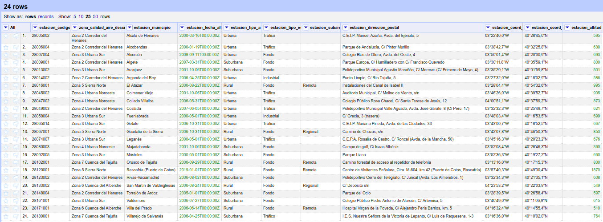
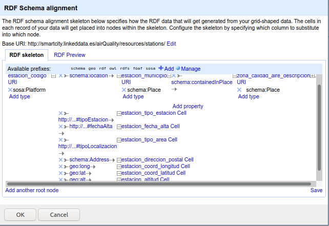

# Datos de calidad del aire de la Comunidad de Madrid

## Introducción

La siguiente memoria describe el proceso de transformación de datos sobre calidad del aire y estaciones de medición en la Comunidad de Madrid. Estos datos han sido obtenidos en el [portal de datos abiertos de la Comunidad de Madrid](https://www.comunidad.madrid/gobierno/datos-abiertos), el cual contiene conjuntos de datos de la comunidad de muy diversas tipologías.

Por un lado, la transformación de los datos a datos enlazados va a permitir la realización de consultas más complejas sobre este conjunto de datos, sobre todo si posteriormente unimos estos datos con los de otros repositorios de información de datos enlazados como puede ser Wikidata. Por poner un ejemplo, sería posible consultar si los municipios con un mayor número de habitantes son los que mayor contaminación presentan como cabría esperar.

Por otro lado, las estadísticas de calidad del aire son especialmente importantes en el mundo en el que vivimos, donde la contaminación y el cambio climático son problemas muy relevantes en la sociedad. Por ello, toda la información que podamos obtener sobre ellos y todas las consultas que podamos hacer que permitan aportar un poco de luz al problema son más que bienvenidas.

## Proceso de transformación

### Selección y obtención de acceso a la fuente de datos

Los datos seleccionados se pueden dividir en dos conjuntos independientes, con un tercero complementario que aporta información que ayuda a comprender los datos:

* [**Conjunto de datos de estaciones**](http://datos.comunidad.madrid/catalogo/dataset/calidad_aire_estaciones): describe las estaciones de medida de datos de calidad del aire presentes en la comunidad, incluyendo datos como la zona, el municipio, la fecha de alta o los gases que puede analizar cada estación. El conjunto se actualiza anualmente, y su última actualización data del 19 de mayo de 2020, por lo que parece que los datos están actualizados.
* [**Conjunto de datos de medidas de calidad del aire**](http://datos.comunidad.madrid/catalogo/dataset/calidad_aire_datos_historico): contiene las medidas de calidad del aire desde el año 2005. Para cada medida, contiene datos sobre el lugar de la medición (estación y municipio), el gas medido y las mediciones para las 24 horas del día. Además, en la página web de los datos se encuentra [el siguiente documento en PDF](https://datos.comunidad.madrid/catalogo/dataset/a770d92c-c513-4974-b1a7-2b15be1dd91f/resource/f743eacc-5e89-4591-a0fc-4caebfe22557/download/descripcion-fichero-datos-de-contaminantes.pdf) que permite interpretar la información contenida en cada una de sus columnas.
* **Conjunto de datos de magnitudes**: en el pdf del segundo conjunto de datos, más concretamente en la Tabla 3 del mismo, aparece un tercer conjunto de datos sobre magnitudes. En el mismo existen datos sobre los distintos gases que se pueden medir en las estaciones, unidades de medida y técnicas de medición. Creo que aporta mucha información interesante y completa los datos que quiero transformar. Por ejemplo, aporta la información sobre el nombre del gas que se está midiendo, ya que en el conjunto de datos de mediciones únicamente aparece el código de las mismas, por lo que creo que es razonable transformar también este conjunto de datos en datos enlazados.

En cuanto al acceso a los mismos, los dos primeros conjuntos se encuentran disponibles para descargar en el mismo portal en formato CSV y JSON, por lo que son fácilmente importables en herramientas de análisis y adecuación de datos como OpenRefine. En cuanto al tercero, se trata de una tabla en un PDF, pero dada su limitada extensión, es fácilmente exportable a formato Excel o CSV para su importación en las herramientas de análisis.

### Análisis de la licencia de los datos

En primer lugar, analizaré la licencia que aplica sobre los datos seleccionados. En la página de ambos conjuntos, podemos ver que la licencia de los mismos es la de [**Atribución** de Creative Commons (Open Data)](https://creativecommons.org/licenses/by/4.0/legalcode.es), con el código **CC BY 4.0**. Esto significa que los datos son libres de ser utilizados por cualquier persona con los fines que se deseen (comerciales o no), y se pueden compartir con la licencia deseada (no necesariamente la misma), pero con la condición de que es necesario atribuir los datos al portal del que son obtenidos.

Aunque la licencia de los datos no incluya explícitamente la condición "Compartir igual", considero que lo más adecuado, ya que únicamente estoy transformando los datos a otro formato, es utilizar la misma licencia que tienen los datos de origen.

### Análisis de la fuente de datos

El primer paso para poder transformar los datos es el análisis de los mismos, para poder entender el conjunto y así obtener un mejor resultado final tras la transformación. Es necesario comprender qué información contiene cada una de las columnas de los datos para así ver cuál es su representación más adecuada en el mundo de los datos enlazados.

Para el análisis de los datos, he utilizado por un lado LibreOffice Calc, dada su facilidad para obtener información sobre los datos de diferentes maneras, y por otro OpenRefine, debido a que será la herramienta que utilizaré para el posterior adecuamiento de los mismos y las facetas ofrecen una muy buena herramienta para su exploración, la detección de anomalías, etc. Cómo ya he comentado, todos los conjuntos de datos descritos están definidos en CSV o Excel, por lo que la carga en ambas herramientas es sencilla.

A continuación, resumiré en tablas el significado y el rango que pueden tomar los valores de cada una de las columnas de nuestros tres conjuntos de datos.

##### Conjunto de datos de mediciones

| Nombre de la columna | Tipo | Descripción | Rango de valores | 
|:------|:------|:------|:------|
| provincia | número | Código numérico de la provincia (siempre será Madrid)  | Siempre valdrá 28, código de la Comunidad de Madrid | 
| municipio | número |  Código numérico del municipio. Se pueden consultar en la Tabla 2 del [pdf que describe el conjunto](https://datos.comunidad.madrid/catalogo/dataset/a770d92c-c513-4974-b1a7-2b15be1dd91f/resource/f743eacc-5e89-4591-a0fc-4caebfe22557/download/descripcion-fichero-datos-de-contaminantes.pdf)  | 5 (Alcalá de Henares) - 180 (Villarejo de Salvanés)  | 
| estacion | número | Código numérico de la estación. Es correlativo, lo asigna el ministerio y sirve para identificar las posibles ubicaciones de las estaciones en ese municipio  | 1 - 14  | 
| magnitud | número | Código numérico del contaminante de la medición. Los distintos valores que puede tomar son los del conjunto de datos de magnitudes, también transformado  | 1 (Dióxido de carbono) - 431 (MetaParaXileno) | 
| punto\_muestreo | string | Código alfanumérico (contiene el caracter '\_') con la siguiente estructura: "{Código de la provincia con 2 números}{Código del municipio con 3 números}{Código de la estación con 3 números}\_{Código de la magnitud}\_{Código de la técnica de medida asociada a la magnitud}" | N/A  | 
| ano | número | Año de la realización de la medición  | Debido a que únicamente he descargado los datos del mes de marzo de 2020, este campo siempre tendrá el valor 2020 | 
| mes | número | Mes de la realización de la medición  | Por la misma razón que el caso anterior, solo podrá tomar el valor 3. | 
| dia | número | Día de la realización de la medición  | 1 - 31 | 
| h01-h24 | número | Valor de las mediciones para cada una de las horas del día. Se realiza una medición por hora, de ahí que existan 24 columnas de este tipo  | 0 - 375 | 
| v01-v24 | carácter | De acuerdo al PDF en el que se explican este conjunto de datos, estas columnas indican si la medición de la hora correspondiente es válida (en ese caso toma el valor V), temporalmente válida (valor T) o inválida (valor N) | Puede tomar los valores V, T y N  | 

Tabla 1: Descripción de las columnas del conjunto de datos de mediciones

##### Conjunto de datos de estaciones

| Nombre de la columna | Tipo | Descripción | Rango de valores | 
|:-----|:-----|:------|:------| 
| estacion\_codigo | número | Código numérico de la estación, que incluye: "{Código de la provincia con dos números}{Código del municipio con 3 números}{Código de la estación con dos números}"  | N/A | 
| zona\_calidad\_aire\_descripcion | string | Zona donde se encuentra la estación  | N/A  |
| estacion\_municipio | string | Municipio donde se encuentra la estación  | N/A | 
| estacion\_fecha\_alta | fecha | Fecha de alta de la estación en el sistema  | 19-1-2000 - 1-1-2019  |
| estacion\_tipo\_area | string | Tipo de área donde se encuentra la estación  | Urbana, Rural y Subrural |
| estacion\_tipo\_estacion | string | Tipo de estación  | Fondo, Industrial y Tráfico  |
| estacion\_subarea\_rural | string | Cómo es el área para las estaciones en un área de tipo "Rural"  | Remota o Regional para estaciones con tipo de área rural, en blanco para el resto  |
| estacion\_direccion\_postal | string | Dirección postal de la estación | N/A |
| estacion\_coord\_UTM\_ETRS89\_x  | número | Coordenada *x* del sistema de coordenadas UTM ETRS89  | 381298 - 481205  |
| estacion\_coord\_UTM\_ETRS89\_y  | número | Coordenada *y* del sistema de coordenadas UTM ETRS89  | 4431618 - 4528767  |
| estacion\_coord\_longitud  | string | Longitud de la estación  | 3º 13' 16'' W - 4º 23' 53,2'' W  |
| estacion\_coord\_latitud  | string | Latitud de la estación  | 40º 01' 59,8'' N - 40º 54' 32,6'' N  |
| estacion\_altitud  | número | Altitud de la estación  | 360 - 1870  |
| estacion\_analizador\_\<siglas del contaminante\> | string | Representa si la estación tiene posibilidad de medir el gas que especifica la columna  | "Sí" o en blanco, si la estación puede medirlo o no, respectivamente  | 

Tabla 2: Descripción de las columnas del conjunto de datos de estaciones

##### Conjunto de datos de mediciones

| Nombre de la columna | Tipo | Descripción | Rango de valores | 
|:-----|:-----|:------|:------| 
| codigo\_magnitud | número | Código numérico de la magnitud a medir. Se puede enlazar con el código numérico del conjunto de mediciones  | 1 - 431  | 
| descripcion\_magnitud | string | Nombre del gas que mide  | N/A  |
| codigo\_tecnica\_medida  | número | Código de la técnica de medida utilizada para la magnitud  | 2, 7, 8, 28, 48, 49 y 59 | 
| descripcion\_tecnica\_medida  | string | Nombre de la técnica de medida  | N/A  |
| unidad | string | Nombre abreviado de la unidad utilizada para la técnica de medida  | mg/m³ o  μ/m³ |
| descripcion\_unidad | string | Nombre de la unidad utilizada para la técnica de medida  | miligramos o microgramos por metro cúbico  |

Tabla 3: Descripción de las columnas del conjunto de datos de mediciones

Es posible comprobar que estamos ante un conjunto de datos muy consistente, que no tiene errores de tipado ni anomalías. Únicamente faltan ciertas medidas, las cuales están claramente identificadas debido al campo complementario que lo indica con una 'N'.

En cuanto al esquema de los mismos, en la página web no se puede encontrar un esquema propiamente dicho, y tampoco provienen de una base de datos relacional para que lo tengan implícito. De todas formas, no es difícil identificar cómo enlazar los tres conjuntos de datos:
* Los conjuntos de magnitudes y de mediciones son fácilmente enlazables mediante los atributos "codigo\_magnitud" del primero y "magnitud" del segundo. No es necesario ningún procesamiento previo a estas columnas para realizar este enlazado.
* En cuanto a los conjuntos de estaciones y mediciones, en realidad es necesario unir las mediciones con los sensores situados en las estaciones. Para ello, es posible utilizar una combinación de los campos "estacion\_codigo" y las magnitudes que puede medir del conjunto de estaciones para construir las URIs de los sensores, y hasta el último carácter '\_' del campo "punto\_muestreo" del conjunto de mediciones, que contiene tanto el código de la estación como el de la magnitud a la que pertenece.

### Estrategia de nombrado de recursos

A continuación, definiré la estrategia que utilizaré para nombrar los recursos de este conjunto. El dominio que he elegido para las URIs de los recursos y los posibles términos ontológicos que se necesiten es el mismo que el utilizado en los ejemplos, http://smartcity.linkeddata.es, debido a que las medidas de contaminación y los sensores de medición considero que están muy relacionadas con el concepto de Smart Cities.

La estrategia a utilizar para nombrar los distintos elementos del vocabulario será la siguiente:

* Para identificar los términos ontológicos, en caso de que sea necesario crear algún elemento por no encontrar otro concepto a reutilizar, utilizaré la '#'. La ruta de los mismos y el patrón para la construcción de las URIs será "http://smartcity.linkeddata.es/airQuality/ontology#<nombre del término\>".
* Para los identificar las estaciones utilizaré el carácter '/', debido a que, aunque no es un conjunto muy grande (24 estaciones) y no es dinámico (no tiene ningún parámetro que se actualice cada poco tiempo), utilizaré estos recursos posteriormente para referirme a los sensores. La ruta y el patrón se definirán como "http://smartcity.linkeddata.es/airQuality/resources/stations/<Código de la estación\>".
* Para las magnitudes voy a utilizar en su lugar el carácter '#', debido a que son pocos datos y no cambian a menudo. La URI para representarlas seguirá el patrón "http://smartcity.linkeddata.es/airQuality/resources/magnitudes#<Código de la magnitud\>".
* Para los datos de mediciones, utilizaré la '/', utilizando el punto de muestreo, la magnitud medida y la fecha de la medición. El patrón será "http://smartcity.linkeddata.es/airQuality/resources/measurement/<Campo "punto\_muestreo" de la tabla sin la información sobre la técnica de medida, y que por tanto contiene información sobre la estación y sobre la magnitud a medir\>/\<Fecha y hora de la medición\>".
* Para los datos de los sensores de las distintas magnitudes alojados en cada una de las estaciones, utilizaré la '#', debido a que son pocos sensores dentro de una estación. Así, el patrón de definición de las URIs será "http://smartcity.linkeddata.es/airQuality/resources/stations/<Código de la estación\>#\<Código de la magnitud que mide\>".
* En cuanto a los municipios y las zonas donde están ubicados, serán representados igualmente con la '#', con los patrones "http://smartcity.linkeddata.es/airQuality/resources/towns#<Nombre del municipio\>" o "http://smartcity.linkeddata.es/airQuality/resources/zones#<Nombre de la zona\>", respectivamente.

### Desarrollo del vocabulario

Los datos de mediciones de calidad del aire se ajustan a una red de sensores que miden el grado de presencia de ciertos elementos contaminantes en el aire. Por ello, he decidido utilizar la ontología estándar del W3C **Semantic Sensor Network Ontology (SSN)**, más concretamente la ontología derivada de la misma y que compone su núcleo **Sensor, Observation, Sample and Actuator (SOSA)**, que contiene muchos elementos ontológicos necesarios para la descripción de nuestros datos. El esquema utilizado para representar los datos de este conjunto se puede observar en la siguiente imagen:

Las equivalencias con nuestro conjunto de datos son las siguientes:

* Las **mediciones** de datos de calidad del aire estarían representadas por individuos de la clase **sosa:Observation**. Estas tendrán asociadas:
	* Un elemento **sosa:hasSimpleResult**, con el resultado de la medición (como **xsd^float**).
	* Una validez descrita por la propiedad definida en nuestra ontología **isValidResult** que tomaría el valor de un rdfs:Literal debido a que puede tomar los valores 'V' para indicar que la medida es válida, 'T' que indica que la medición es válida temporalmente y 'N' que indica que no es válida.
	* La fecha y hora de la medición, mediante la propiedad **sosa:resultTime** y objetos **xsd^^dateTime**.
* Las **estaciones** de medición de calidad del aire estarían representadas por la clase **sosa:Platform**, debido a que alojan varios sensores para medir las distintas magnitudes de calidad del aire. Este elemento tendrá asociado:
	* Están ubicadas en un municipio representado por la clase **schema:Place**, que a su vez está contenido (**schema:containedInPlace**) en una zona, también descrita por la clase **schema:Place**.
	* Fecha de alta mediante la propiedad definida en mi ontología **fechaAlta**, y de tipo **xsd^date**.
	* El tipo de estación, utilizando la propiedad **tipoEstacion**.
	* El tipo de zona donde está ubicada la estación mediante la propiedad **zonaEstacion**.
	* Dirección mediante la propiedad **schema:address** y la clase **schema:PostalAddress**.
	* Punto de coordenadas, descrito por las propiedades **geo:lat**, **geo:long** y **geo:alt** del vocabulario WGS84. Debido a que en el conjunto de datos vienen como los grados, minutos y segundos, he optado por utilizar **rdfs:Literal** de tipo string para describir la latitud y la longitud, aunque normalmente se utilicen floats.
* Los **sensores** para cada una de las magnitudes alojados por las distintas estaciones serán representados por individuos de la clase **sosa:Sensor**. Estos estarán asociados a las observaciones, las magnitudes y las estaciones (Platform) mediante las propiedades estándar del vocabulario **sosa**.
* Por último, las **magnitudes** a medir serán de la clase **sosa:ObservableProperty**. Estarán descritas por:
	* Un título o nombre de la magnitud mediante la propiedad **dc:title**, representado por un **rdfs:Literal**.
	* Una unidad de medida mediante la propiedad **om:hasUnit** de la **Ontology of units of Measure** ([link](https://github.com/HajoRijgersberg/OM)). Sin embargo, en dicha ontología no se encontraba la magnitud que más aparecía en nuestros datos, microgramos por metro cúbico, por lo que he definido mi propia clase **Unidad**. Esta tiene una **rdfs:label** que se asocia con un **rdfs:Literal** que indica el nombre de la unidad.
	* Para las distintas técnicas de medición especificadas para las magnitudes no he podido encontrar una ontología que se ajustase de forma correcta a las mismas, por lo que he definido la clase **Tecnica** con la propiedad **hasTecnica**. Esta tiene un título (propiedad **dc:title**) que lo relaciona con un **rdfs:Literal**.

### Proceso de transformación de los datos

En esta sección se describe el proceso de adecuación de los datos para su posterior transformación a datos enlazados en RDF. Para ello utilizaré la herramienta de OpenRefine que, junto con la extensión de RDF, permite realizar esta transformación de una forma sencilla.

#### Conjunto de datos de mediciones

Los datos de mediciones tienen el siguiente formato nada más cargar el fichero CSV en la herramienta OpenRefine:

El mismo cuenta con 4991 filas, y en cada fila existen en realidad 24 observaciones, pues las mismas se representan mediante columnas. Los siguientes pasos permiten adecuar el conjunto al vocabulario definido:

1. En primer lugar es necesario transponer las columnas de las mediciones para poder tener un registro por cada observación. Para ello, primero hay que unir las mediciones en sí mismas con las columnas que expresan su validez. Esto se puede realizar con una operación *join columns*, en este caso mediante el separador '-'.
2. A continuación, se eliminan las columnas de la validez, pues ya aparece esa información en la columna de la magnitud. Al finalizar este paso el conjunto quedaría como en la siguiente imagen.

3. El siguiente paso es la transposición de las columnas con las mediciones. De esta forma existirán 24 registros por cada fila antigua, uno con la medición de cada hora. El nombre de la columna se mantiene en una columna nueva llamada 'hora', pues será utilizado para obtener la marca temporal de la medida.
4. Separo la medida de la validez por el separador utilizado en el paso 1 ('-').

5. Elimino la 'h' de la columna de la hora para quedarme únicamente con el número, lo uno con el año, el mes y el día utilizando el '-' de nuevo (para ello es necesario hacer la operación *fill-down* en primer lugar) y se procesa como fecha indicándole el formato ("yyyy-M-dd-kk"). Elimino las columnas que se han incorporado en la marca temporal (mes, día, hora) y ya no son necesarias.

6. Elimino las columnas que no se van a utilizar (provincia, municipio, estación y código estación) y hago *fill-down* del resto de columnas para obtener todo como filas. Tengo así 119784 filas.

7. Para poder obtener las URIs tanto del sensor como del id que utilizaré para identificar cada medición, voy a utilizar la columna "punto\_muestreo", de la que no me interesa la última parte, que representa la técnica de medición, por lo que se realiza una transformación para eliminar desde la última '\_' hasta el final.
8. Por último, para obtener la columna que utilizaré como identificador para construir las URIs de las mediciones ("\<Código de la estación\>/\<Fecha y hora de la medición\>), uno los campos de "punto\_muestreo" que se acaba de adaptar y de la marca temporal mediante el carácter '/' en una nueva columna.
9. Para poder obtener la URI del sensor que realizó la magnitud, la cual tiene la forma "\<Código de la estación\>#\<Código de la magnitud\>", se puede aprovechar de nuevo la columna "punto\_muestreo", reemplazando la '\_' por '#'.

Por último, creo el esqueleto de RDF de los datos. Este tiene la siguiente forma:

#### Conjunto de datos de estaciones

Del mismo fichero de las estaciones de medición se obtienen dos conjuntos distintos realizando dos procesamientos distintos: por un lado obtendré los datos de los sensores (individuos de la clase **sosa:Sensor**) y por otro el de las estaciones propiamente dichas (**sosa:Platform**).

##### Procesamiento para obtener los sensores

1. Los datos sobre los sensores de cada estación se encuentran en las últimas columnas de cada fila, donde existe una columna para cada magnitud que puede ser medida, y las estaciones tienen el valor "Sí" para aquellas que pueden medir. Por ello, el primer paso será trasponer estas columnas para obtener los datos de sensores como filas. Como solo quiero los datos de aquellas magnitudes que las estaciones puedan medir, especifico que se salte las filas en blanco.

2. Elimino el texto "estacion\_analizador\_" de la columna de magnitud y, para poder enlazarlo con las magnitudes, necesito obtener el código de la magnitud y no las siglas del compuesto químico que analiza. Para ello, he realizado un diccionario de forma manual que realiza la sustitución, mediante una transformación con Python.

3. Elimino todas las columnas que no son el código de la estación y la magnitud que mide, pues son características de la estación, no del sensor, y hago *fill-down* de la columna "estacion\_codigo"

Por último, creo el esqueleto RDF de estos datos, que queda como sigue:

El identificador elegido en este caso, "\<Código de la estación\>#\<Código de la magnitud que mide\>", utiliza los datos de dos columnas. Por ello, para construir correctamente la URI a partir dichos valores, la he construido a partir de la columna "estacion\_codigo" y he utilizado la expresión `value + '#' + cells['magnitud'].value`.

##### Procesamiento para obtener las estaciones

1. Elimino todas las columnas relacionadas con sensores, debido a que ya no son necesarias.
2. Elimino las columnas con las coordenadas UTM ETRS89, debido a que utilizaré las coordenadas geográficas expresadas mediante la latitud y la longitud.
3. Convierto las columnas altitud y fecha de alta a número y fecha, respectivamente.

4. Debido a que la columna "estacion\_subarea\_rural" solo tiene valores para columnas cuya "estacion\_tipo\_area" sea "Rural", voy a unir estas dos columnas para dejarlo como una sola, mediante el carácter '-'. Debido a que ya tengo el dato en la unión, es posible eliminar la columna "estacion\_subarea\_rural".

El esqueleto RDF de este conjunto de datos queda como aparece en la siguiente imagen:

#### Conjunto de magnitudes

Por último, solo quedaría por procesar el conjunto de datos de magnitudes. Cargando los datos a partir del CSV no interpretaba correctamente el carácter μ de las unidades, por lo que lo he cargado a partir de una tabla de Excel. La previsualización del mismo se puede ver en la siguiente imagen:

El procesamiento realizado a este conjunto únicamente implica dos pasos:

1. Convierto las columnas de los códigos de la magnitud y de la técnica de medida a texto, debido a que al cargar desde Excel directamente lo renderiza de esta forma. Al cambiarlo, lo hacía con la marca decimal, por lo que para evitar esto, lo hago con Python y la siguiente expresión: `return str(int(value))`.
2. Modifico el carácter que simboliza el cubo para convertirlo en un '3', por si posteriormente causa problemas a la hora de convertir a Turtle u otro formato.

En este caso, el esqueleto RDF del conjunto queda como se puede ver en la imagen:

### Enlazado

El último paso en el procesamiento de los datos es el proceso de enlazado de los mismos, de tal forma que no se encuentren aislados del resto de datos de la web y puedan ser reutilizados y aprovechados por otros investigadores.

Mediante la función de reconciliación de la extensión de RDF de OpenRefine, es posible reconciliar algunos de los campos de nuestros datos. Como por ejemplo los municipios donde se sitúan las estaciones o las magnitudes a medir.

#### Reconciliación de municipios

El primer campo a reconciliar será el de las columnas que hacen referencia a los municipios donde se encuentran las estaciones, con las entradas de dichos municipios en Wikidata. De esta forma, será posible así realizar consultas más complejas mediante SPARQL incluyendo datos de los municipios que proporciona esta fuente.

Así, la reconciliación de los datos con Wikidata sugiere utilizar el tipo "municipality of Spain". Si realizo la reconciliación se asocian todos ellos salvo uno, "Rascafría (Puerto de Cotos)", que es posible asociar manualmente con Rascafría.

Tras la reconciliación y la obtención de la columna que indica la URI del recurso que ha asociado, se obtiene un conjunto como el que aparece en la siguiente imagen.

Con ello, es posible añadir esta URI a nuestro esqueleto RDF, asociando el recurso municipio que existía anteriormente (individuo de la clase http://smartcities.linkeddata.es/airQuality/towns#) con esta nueva URI mediante la propiedad **owl:sameAs**.

#### Reconciliación de las magnitudes

También es posible utilizar Wikidata para reconciliar las magnitudes (elementos contaminantes) de nuestro conjunto a partir de su nombre (campo "descripcion\_magnitud"). Así, Wikidata recomienda utilizar el tipo "chemical compound".

En este caso, debido a que los nombres están en español, son pocos los que asocia automáticamente, pero no resulta difícil encontrarlos y asociarlos a mano, para finalizar la reconciliación.

De igual forma que en el caso de los municipios, es posible añadir a las magnitudes la propiedad **owl:sameAs** y enlazarlo así con los datos que contiene Wikidata sobre cada una de estas magnitudes.

### Descripción del conjunto

Otra buena práctica cuando se transforman conjuntos de datos a datos enlazados es la de crear metadatos sobre el conjunto en sí mismo, es decir, describir cómo está estructurado, que conjuntos de datos lo conforman, donde se encuentran accesibles, etc. Para ello he decidido utilizar [el vocabulario DCAT](https://www.w3.org/TR/vocab-dcat-2/).

La descripción realizada se puede encontrar en el fichero [linkedData/descripcion.ttl](linkedData/descripcion.ttl). En él, defino un catálogo general (individuo de la clase **dcat:Catalog**) donde van a estar el resto de conjuntos alojados, y le proporciono un título, una descripción, el lenguaje, licencia, algunas palabras clave y los conjuntos de datos en sí mismos con la propiedad **dcat:dataset**.

Adicionalmente describo los 4 conjuntos de datos por separado, como individuos de la clase **dcat:Dataset**, y les proporciono una serie de metadatos como son el título, palabras clave, cuándo han sido creados y modificados, el lenguaje, la descripción o la licencia.

## Aplicación y explotación

Ahora que los datos han sido transformados a datos enlazados y se encuentran en formato RDF, es posible leerlos utilizando un programa en Java o Python para interpretar estos datos y hacerles queries complejas que permitan entenderlos mejor. En mi caso he realizado 3 aplicaciones distintas, todas ellas utilizando la librería rdflib de Python. He elegido Python por aprender otra librería para hacer queries a este tipo de datos además de Jena, por la facilidad del lenguaje y por la fácil representación de los datos utilizando la librería matplotlib.

El código de todas ellas puede encontrarse en el IPython Notebook en [app/application.ipynb](app/application.ipynb).

### Representación de las estaciones en un mapa

La primera y más sencilla de las aplicaciones es la representación de las estaciones sobre el mapa de la Comunidad de Madrid, a partir de las coordenadas de las estaciones del conjunto.

Para ello, únicamente es necesario que seleccionar aquellas tripletas de nuestros datos que tienen las propiedades de latitud (**geo:lat**) y longitud (**geo:long**), pues los individuos del conjunto de estaciones son los únicos sujetos con estas propiedades.

### Análisis de la correlación entre la población de un municipio y los datos de contaminación

Otro análisis interesante que es posible realizar es si en los barrios con un mayor número de habitantes existen unos índices de contaminación mayores. Al menos para mí cabría esperar de alguna forma que sí, pues cuanta más población tenga un municipio, más gente se desplaza en coche cerca de la estación allí ubicada, y por tanto causa unos niveles de contaminación mayores.

Para obtener la población que tiene un municipio, es posible utilizar el campo que he reconciliado, la URI del recurso en Wikidata, para hacer queries al SPARQL endpoint de la misma y obtener así la población. En primer lugar tendré que obtener dichas URIs: para ello es posible tanto recorrer el grafo de forma manual como realizar SPARQL queries al mismo. En el notebook asociado están desarrollados ambos métodos.

Una vez obtenidas los identificadores de Wikidata de los recursos, realizo las consultas a [su SPARQL endpoint](http://query.wikidata.org/sparql), más concretamente se obtienen las propiedades **wdt:P1082** (población) y **wdt:P1448** (nombre).

Además de la población, son necesarios los datos de contaminación de la estación situada en el municipio en un momento concreto, he elegido un miércoles a las 6 de la tarde. En concreto voy a analizar los elementos contaminantes O3, NO y NO2. Para ello construyo las URIs de dichas mediciones a partir del identificador del contaminante y la fecha y hora seleccionadas. Solo quedaría rellenar la URI con el identificador de la estación para todas las estaciones de nuestro conjunto y obtener los valores.

En la siguiente figura se representan los resultados obtenidos:

Como se puede apreciar, parece que mi suposición inicial no se cumple, y de hecho los valores más altos de estos contaminantes se encuentran en lugares con muy poca población.

### Análisis del impacto del coronavirus en las medidas de contaminación

También sería posible analizar el efecto del confinamiento debido a la pandemia de COVID sobre la calidad del aire de la comunidad: cabe esperar que, debido al confinamiento, la calidad del aire aumentase en cierta medida durante la segunda mitad del mes de marzo, pues existía un tráfico mucho menor de coches.

Para obtener estos valores, he seleccionado una hora para cada día, las 6 de la tarde; ciertos contaminantes, los mismos que en el caso anterior O3, NO y NO2 y una estación, la de Alcorcón. Únicamente es necesario construir las URIs de las mediciones que se quieran consultar en el grafo modificando el día del mes a partir de la URI base. En la siguiente figura es posible ver los resultados del análisis:

Como se puede ver, no existe una tendencia clara en los datos, y no diría que los niveles de los contaminantes analizados han disminuido durante el mes de marzo. Quizá analizando meses más adelante se pudiera ver una tendencia a la baja, pero en el mes de marzo no parece haberla.

## Conclusiones

Para mí la conclusión principal que he obtenido de la realización de esta práctica ha sido que el proceso de transformación de datos a datos enlazados es tremendamente útil. Esto es sobre todo debido a que, tras la subida de los datos transformados a alguna plataforma que pueda alojarlos y el enlazado con otros conjuntos, creo que puede dar lugar a consultas muy complejas y que aporten mucha más información de la que se podría obtener con los conjuntos de datos por separado. En concreto me ha parecido especialmente útil el enlazado con los recursos de Wikidata para poder obtener información adicional sobre los elementos del conjunto, ya que es lo que me ha parecido que sería muy complicado de hacer sin que los datos hayan sido convertidos previamente a datos enlazados.

Por otro lado me ha parecido un proceso mucho más complejo de lo que parecía al ver la teoría. En concreto me ha parecido complejo el proceso de encontrar vocabularios relacionados que puedan servir para el conjunto que estoy intentando transformar, la utilización correcta de estos vocabularios, saber cuándo hay que crear nuevos términos y la transformación de los datos para adecuarlos al vocabulario definido.

De todas formas estoy bastante contento con el resultado que he obtenido, y creo que me ha servido enormemente para aprender y afianzar todo lo visto durante la teoría.

## Bibliografía

* [Portal de datos abiertos de la Comunidad de Madrid](https://www.comunidad.madrid/gobierno/datos-abiertos)
* [Best Practices for Publishing Linked Data](https://www.w3.org/TR/ld-bp/)
* [Protegé](https://protege.stanford.edu/)
* [OpenRefine](https://openrefine.org/)
* [Semantic Sensor Network Ontology](https://www.w3.org/TR/vocab-ssn/)
* [Ontology of units of Measure](https://github.com/HajoRijgersberg/OM)
* [Geo (WGS84 lat/long) Vocabulary](https://www.w3.org/2003/01/geo/)
* [Schema.org](https://schema.org/)
* [Dublin Core Metadata Initiative](https://www.dublincore.org/specifications/dublin-core/dcmi-terms/)
* [Data Catalog Vocabulary (DCAT)](https://www.w3.org/TR/vocab-dcat-2/)
* [Documentación de la librería RDFLib de Python](https://rdflib.readthedocs.io/en/stable/index.html)
* [Documentación de la librería SPARQLWrapper de Python](https://sparqlwrapper.readthedocs.io/en/latest/main.html)
